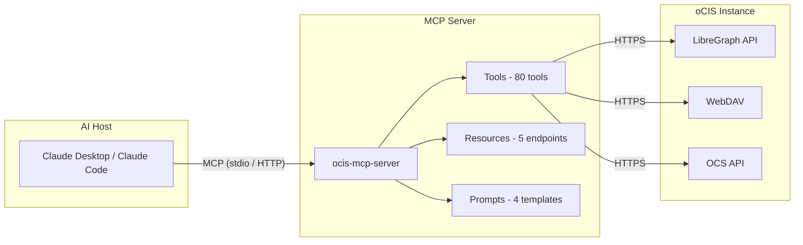

# ocis-mcp-server

A standalone [Model Context Protocol (MCP)](https://modelcontextprotocol.io/) server that exposes
[ownCloud Infinite Scale (oCIS)](https://owncloud.dev/) as a set of MCP tools. It enables AI
assistants such as Claude to manage users, groups, spaces, files, shares, and more through natural
language.

## Guides

New to this? Check out the **[Getting Started Guide](GETTING_STARTED.md)** -- a step-by-step walkthrough
for connecting the MCP server with Claude Desktop or Ollama on Mac, Windows, and Linux. Includes a
setup script (`install.sh`) that detects your system and helps you configure everything.

## Why Standalone?

This server is intentionally separate from the oCIS codebase:

- **External client** -- communicates with oCIS over its public APIs (LibreGraph, WebDAV, OCS)
  exactly the way any other integration would.
- **No oCIS Go imports** -- zero dependency on oCIS internals; works with any oCIS version that
  exposes the standard API surface.
- **Independent release cadence** -- can ship fixes and new tools without waiting for an oCIS
  release cycle.
- **Minimal dependency tree** -- only the MCP Go SDK and the standard library.

## Architecture



## Quickstart

### Prerequisites

- A running oCIS instance
- An app token or OIDC access token for authentication
- Go 1.25+ (only for building from source)

### Install from Release

Download a pre-built binary from the [Releases](https://github.com/owncloud/ocis-mcp-server/releases)
page, extract the archive, and make it executable:

```bash
# Example for macOS (Apple Silicon)
tar xzf ocis-mcp-server_*_darwin_arm64.tar.gz
chmod +x ocis-mcp-server
```

> **macOS users:** macOS quarantines downloaded binaries. You must remove the quarantine flag
> before the binary can run:
>
> ```bash
> xattr -d com.apple.quarantine ocis-mcp-server
> ```
>
> Without this step, macOS will show *"Apple could not verify this software"* and Claude Desktop
> will fail with *"Permission denied"*.

### Build from Source

```bash
go build -o ocis-mcp-server ./cmd/ocis-mcp-server
```

Or use Make:

```bash
make build
```

### Claude Desktop Configuration

Add to your Claude Desktop config (`~/Library/Application Support/Claude/claude_desktop_config.json`
on macOS):

```json
{
  "mcpServers": {
    "ocis": {
      "command": "/path/to/ocis-mcp-server",
      "env": {
        "OCIS_MCP_OCIS_URL": "https://your-ocis-instance.example.com",
        "OCIS_MCP_APP_TOKEN_USER": "admin",
        "OCIS_MCP_APP_TOKEN_VALUE": "your-app-token-here"
      }
    }
  }
}
```

### Claude Code Configuration

Add to `.mcp.json` in your project root or `~/.claude/mcp.json` globally:

```json
{
  "mcpServers": {
    "ocis": {
      "command": "/path/to/ocis-mcp-server",
      "env": {
        "OCIS_MCP_OCIS_URL": "https://your-ocis-instance.example.com",
        "OCIS_MCP_APP_TOKEN_USER": "admin",
        "OCIS_MCP_APP_TOKEN_VALUE": "your-app-token-here"
      }
    }
  }
}
```

## Authentication

### App Tokens (Recommended)

App tokens provide scoped, revocable credentials ideal for MCP server use:

1. Log in to oCIS web UI as the target user.
2. Navigate to **Settings > Security > App tokens**.
3. Create a new token with an appropriate label (e.g., "MCP Server").
4. Set the environment variables:

```bash
export OCIS_MCP_OCIS_URL="https://ocis.example.com"
export OCIS_MCP_APP_TOKEN_USER="admin"
export OCIS_MCP_APP_TOKEN_VALUE="<token-value>"
```

### OIDC (Alternative)

For environments using OpenID Connect:

```bash
export OCIS_MCP_OCIS_URL="https://ocis.example.com"
export OCIS_MCP_AUTH_MODE="oidc"
export OCIS_MCP_OIDC_ACCESS_TOKEN="<access-token>"
```

Optionally, if you need token refresh:

```bash
export OCIS_MCP_OIDC_ISSUER="https://idp.example.com"
export OCIS_MCP_OIDC_CLIENT_ID="ocis-mcp"
export OCIS_MCP_OIDC_CLIENT_SECRET="<client-secret>"
```

## Environment Variables

| Variable | Required | Default | Description |
|---|---|---|---|
| `OCIS_MCP_OCIS_URL` | Yes | -- | Base URL of the oCIS instance (e.g., `https://ocis.example.com`) |
| `OCIS_MCP_AUTH_MODE` | No | auto-detect | Authentication mode: `app-token` or `oidc` |
| `OCIS_MCP_APP_TOKEN_USER` | No | -- | Username for app token authentication |
| `OCIS_MCP_APP_TOKEN_VALUE` | No | -- | App token value |
| `OCIS_MCP_OIDC_ISSUER` | No | -- | OIDC issuer URL |
| `OCIS_MCP_OIDC_CLIENT_ID` | No | -- | OIDC client ID |
| `OCIS_MCP_OIDC_CLIENT_SECRET` | No | -- | OIDC client secret |
| `OCIS_MCP_OIDC_ACCESS_TOKEN` | No | -- | OIDC access token (pre-obtained) |
| `OCIS_MCP_EDUCATION_ACCESS_TOKEN` | No | -- | Separate token for Education API (enables education tools) |
| `OCIS_MCP_TRANSPORT` | No | `stdio` | Transport mode: `stdio` or `http` |
| `OCIS_MCP_HTTP_ADDR` | No | `127.0.0.1:8090` | Listen address for HTTP transport |
| `OCIS_MCP_LOG_LEVEL` | No | `info` | Log level: `debug`, `info`, `warn`, `error` |
| `OCIS_MCP_INSECURE` | No | `false` | Allow plaintext HTTP connections (dev only) |
| `OCIS_MCP_TLS_SKIP_VERIFY` | No | `false` | Skip TLS certificate verification (dev only) |
| `OCIS_MCP_HTTP_TIMEOUT` | No | `30s` | HTTP client timeout for oCIS API calls |

## Tool Inventory

The server exposes 80 tools organized into 13 categories:

### Users (6 tools)

| Tool | Description |
|---|---|
| `ocis_list_users` | List all users with optional search filter |
| `ocis_get_user` | Get a user by ID |
| `ocis_create_user` | Create a new user account |
| `ocis_update_user` | Update user properties |
| `ocis_delete_user` | Delete a user account |
| `ocis_get_me` | Get the authenticated user's profile |

### Groups (7 tools)

| Tool | Description |
|---|---|
| `ocis_list_groups` | List all groups with optional search filter |
| `ocis_get_group` | Get a group by ID |
| `ocis_create_group` | Create a new group |
| `ocis_update_group` | Update group properties |
| `ocis_delete_group` | Delete a group |
| `ocis_add_group_member` | Add a user to a group |
| `ocis_remove_group_member` | Remove a user from a group |

### Spaces (14 tools)

| Tool | Description |
|---|---|
| `ocis_list_spaces` | List all spaces (drives) in the instance |
| `ocis_list_my_spaces` | List spaces the authenticated user has access to |
| `ocis_get_space` | Get space details by ID |
| `ocis_create_space` | Create a new project space |
| `ocis_update_space` | Update space name, description, or quota |
| `ocis_disable_space` | Disable (deactivate) a space |
| `ocis_delete_space` | Permanently delete a disabled space |
| `ocis_restore_space` | Restore a disabled space |
| `ocis_invite_to_space` | Invite a user or group to a space with a role |
| `ocis_create_space_link` | Create a public link to a space |
| `ocis_list_space_permissions` | List all permissions on a space |
| `ocis_empty_trashbin` | Empty the trash bin of a space |
| `ocis_set_space_image` | Set the image/avatar for a space |
| `ocis_set_space_readme` | Set the description file (README) for a space |

### Files (14 tools)

| Tool | Description |
|---|---|
| `ocis_list_files` | List files and folders in a space at a given path |
| `ocis_get_file_info` | Get metadata for a file or folder |
| `ocis_create_folder` | Create a new folder |
| `ocis_upload_file` | Upload a file (content as base64 or text) |
| `ocis_download_file` | Download a file's content |
| `ocis_move_file` | Move or rename a file/folder |
| `ocis_copy_file` | Copy a file/folder |
| `ocis_delete_file` | Delete a file or folder |
| `ocis_get_file_versions` | List version history for a file |
| `ocis_restore_file_version` | Restore a previous version of a file |
| `ocis_get_resource_by_id` | Get a resource (file/folder) by its unique ID |
| `ocis_tag_resource` | Add a tag to a file or folder |
| `ocis_untag_resource` | Remove a tag from a file or folder |
| `ocis_get_resource_metadata` | Get extended metadata for a resource |

### Shares (11 tools)

| Tool | Description |
|---|---|
| `ocis_create_share` | Share a file or folder with a user or group |
| `ocis_create_link` | Create a public sharing link |
| `ocis_list_shares` | List shares on a specific resource |
| `ocis_update_share` | Update share permissions or role |
| `ocis_update_share_expiration` | Update the expiration date on a share |
| `ocis_delete_share` | Remove a share |
| `ocis_list_shared_by_me` | List all shares created by the authenticated user |
| `ocis_list_received_shares` | List all shares received by the authenticated user |
| `ocis_accept_share` | Accept a pending received share |
| `ocis_reject_share` | Reject a pending received share |
| `ocis_get_sharing_roles` | List available sharing roles and their permissions |

### Search (2 tools)

| Tool | Description |
|---|---|
| `ocis_search` | Full-text search across all accessible files |
| `ocis_search_by_tag` | Search for resources by tag |

### Notifications (2 tools)

| Tool | Description |
|---|---|
| `ocis_list_notifications` | List notifications for the authenticated user |
| `ocis_delete_notification` | Delete (dismiss) a notification |

### Settings (3 tools)

| Tool | Description |
|---|---|
| `ocis_list_roles` | List available roles in the system |
| `ocis_assign_role` | Assign a role to a user |
| `ocis_list_assignments` | List current role assignments |

### App Tokens (3 tools)

| Tool | Description |
|---|---|
| `ocis_list_app_tokens` | List app tokens for the authenticated user |
| `ocis_create_app_token` | Create a new app token |
| `ocis_delete_app_token` | Delete an app token |

### Admin (4 tools)

| Tool | Description |
|---|---|
| `ocis_health_check` | Check oCIS instance health |
| `ocis_get_version` | Get oCIS server version information |
| `ocis_get_capabilities` | Get oCIS server capabilities |
| `ocis_get_config` | Get current MCP server configuration (no secrets) |

### Education (5 tools)

| Tool | Description |
|---|---|
| `ocis_list_education_schools` | List education schools |
| `ocis_get_education_school` | Get details for a specific school |
| `ocis_list_education_users` | List education users |
| `ocis_get_education_user` | Get details for a specific education user |
| `ocis_create_education_user` | Create a new education user |

### OCM - Open Cloud Mesh (4 tools)

| Tool | Description |
|---|---|
| `ocis_ocm_list_providers` | List federated sharing providers |
| `ocis_ocm_create_share` | Create a federated share with a remote provider |
| `ocis_ocm_list_shares` | List outgoing federated shares |
| `ocis_ocm_list_received` | List received federated shares |

### Workflows (5 tools)

| Tool | Description |
|---|---|
| `ocis_upload_and_share` | Upload a file and share it in one operation |
| `ocis_create_project_space` | Create a project space with initial structure |
| `ocis_find_and_download` | Search for a file and download it |
| `ocis_share_with_link` | Create a public link for a resource |
| `ocis_get_space_overview` | Get a comprehensive overview of a space |

## MCP Resources

The server exposes 5 read-only resources:

| URI | Description |
|---|---|
| `ocis://capabilities` | Cached oCIS server capabilities including supported features and limits |
| `ocis://version` | oCIS server version string |
| `ocis://sharing-roles` | Available sharing roles and their permission sets |
| `ocis://drive-types` | Supported drive types: personal, project, shares, virtual |
| `ocis://auth-mode` | Current authentication mode and connection info (no credentials) |

## MCP Prompts

The server provides 4 guided workflow prompts:

| Prompt | Description |
|---|---|
| `ocis_onboard_user` | Step-by-step guide: create a user, assign a role, add to project spaces |
| `ocis_migrate_files` | Guide: list files in source space, copy to destination, verify |
| `ocis_audit_space` | Audit a space: metadata, permissions, recent activity |
| `ocis_share_report` | Generate a sharing report for a user: shares created and received |

## Docker

### Build

```bash
make docker-build
```

### Run

```bash
docker run --rm \
  -e OCIS_MCP_OCIS_URL="https://ocis.example.com" \
  -e OCIS_MCP_APP_TOKEN_USER="admin" \
  -e OCIS_MCP_APP_TOKEN_VALUE="your-token" \
  -e OCIS_MCP_TRANSPORT="http" \
  -p 8090:8090 \
  owncloud/ocis-mcp-server:latest
```

The HTTP transport listens on port 8090 by default. The MCP endpoint is available at
`http://localhost:8090/mcp`.

### Stdio via Docker

For Claude Desktop/Code integration using stdio transport:

```json
{
  "mcpServers": {
    "ocis": {
      "command": "docker",
      "args": [
        "run", "--rm", "-i",
        "-e", "OCIS_MCP_OCIS_URL=https://ocis.example.com",
        "-e", "OCIS_MCP_APP_TOKEN_USER=admin",
        "-e", "OCIS_MCP_APP_TOKEN_VALUE=your-token",
        "owncloud/ocis-mcp-server:latest"
      ]
    }
  }
}
```

## Development

### Project Structure

```
ocis-mcp-server/
  cmd/ocis-mcp-server/   # Application entry point
  internal/
    client/               # oCIS HTTP client (LibreGraph, WebDAV, OCS)
    config/               # Environment-based configuration
    tools/                # MCP tool, resource, and prompt implementations
  go.mod
  go.sum
```

### Build and Test

```bash
make build          # Build the binary
make test           # Run tests with race detector
make lint           # Run golangci-lint
make cover          # Generate coverage report
make clean          # Remove build artifacts
make docker-build   # Build Docker image
```

### Adding a New Tool

1. Create or edit the appropriate file in `internal/tools/` (e.g., `files.go` for file operations).
2. Define a registration function following the existing pattern (see `registerUsers` in `users.go`).
3. Call your registration function from `RegisterAll` in `register.go`.
4. Add tests.
5. Update this README's tool inventory table.

## Contributing

Contributions are welcome. Please see the [ownCloud contribution guidelines](https://owncloud.dev/contributing/).

Before submitting a pull request:

1. Ensure `make lint` passes.
2. Ensure `make test` passes with no failures.
3. Maintain or improve test coverage (minimum 70%).
4. Update documentation if adding or changing tools.

## License

Apache 2.0 -- see [LICENSE](LICENSE) for the full text.
